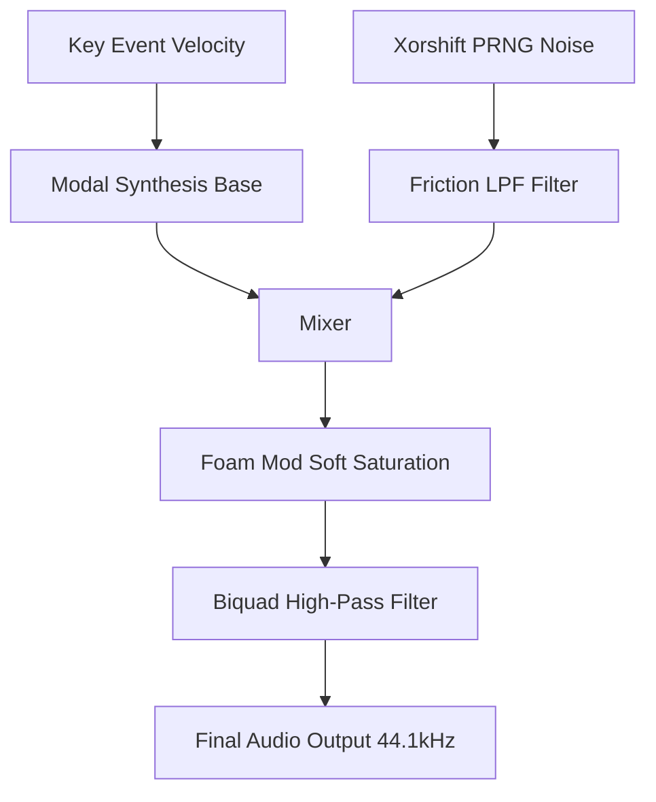

# Thock Procedural DSP Engine

This document outlines the mathematical architecture of the `thock` real-time procedural sound engine (`src/dsp.rs`), the original problems it faced, and the algorithmic solutions currently implemented.

## 1. The Original Problem

When the procedural engine was first implemented, it suffered from two major issues: **Acoustic Mismatch** and **CPU Inefficiency**.

### Acoustic Mismatch ("The Piano Problem")
The user reported that the generated sounds felt "muffled", like "someone put a weight on the speaker", or resembled a "piano or musical instrument" rather than a plastic mechanical switch.
- **Incorrect Fundamental Frequency:** The engine was originally tuned to a fundamental frequency ($f_0$) of 240 Hz (roughly a musical G#3). This is far too low; mechanical switches are small, stiff objects that resonate at much higher frequencies.
- **Sluggish Attack Envelope:** The attack time was set to 1.8ms. While fast for a piano, a hard plastic stem hitting a housing completes its initial transient in under 0.4ms.
- **Poor Energy Distribution:** The upper modal frequencies (the "clack") had their amplitudes severely dampened, putting 90% of the acoustic energy into the muddy sub-bass region.

### CPU Inefficiency
- **Per-Sample Division:** The engine calculated time for every single audio sample using integer division: $t = \frac{\text{cursor}}{\text{sample\_rate}}$. At 44.1kHz, this meant ~2,646 floating-point divisions per keystroke, causing unnecessary CPU overhead and thermal load on the macOS main thread.

---

## 2. The Algorithm (Current Solution)

The engine now uses **Physics-Informed Modal Synthesis** combined with a **Direct Form II Transposed Biquad Filter** chain. 

### A. Physics-Based Modal Synthesis
Instead of playing back a static audio file, the engine simulates the physical components of a keyboard switch using four damped sinusoidal oscillators (modes). Each mode represents a different physical vibration (e.g., the stem hitting the bottom housing, the plate resonating, the spring ping).

The equation for a single mode is:
$$ y_m(t) = A_m \cdot e^{-d_m t} \cdot \sin(2\pi f_m t) $$

Where:
- $A_m$ is the amplitude of the mode.
- $d_m$ is the decay coefficient, calculated as $d_m = \frac{1}{\tau_m}$ (where $\tau_m$ is the decay time in seconds).
- $f_m$ is the resonant frequency of the mode.

**The Fix:** We shifted the fundamental frequency ($f_0$) based on the `plate_material`:
- **POM (NK Cream):** $f_0 = 1450 \text{ Hz}$
- **Brass:** $f_0 = 2800 \text{ Hz}$
- **Aluminum:** $f_0 = 2100 \text{ Hz}$

We inverted the amplitude distribution so that **85% of the energy** sits in the 1.2kHz–3.5kHz "clack" band, giving it a sharp, crisp plastic impact sound instead of a muddy piano tone.

### B. Procedural Parameters Mapping
The algorithm dynamically generates the sound based on user-provided variables in real-time:

1. **Spring Weight ($w$):** Directly scales the impact velocity. A heavier spring (e.g., 90g) increases the global amplitude and slightly shortens the decay time due to higher tension.
2. **Lube Amount ($l$):** Controls the injection of White Noise $N(t)$. Heavy lube ($l \to 1.0$) applies a Low-Pass Filter (LPF) to the noise, simulating the suppression of high-frequency "scratchiness".
3. **Key Up vs Key Down:** The algorithm detects if the event is a key release (top-out). Because the top housing of a switch is thinner than the bottom housing, the engine automatically multiplies $f_0$ by $1.35$ on `KeyUp`, producing a higher-pitched, hollower sound.

### C. The Accumulator Optimization
To fix the CPU overhead, the algorithm was rewritten to use a **Time Accumulator**.

Instead of calculating $t$ from scratch via division on every tick:
```rust
// Old, slow algorithm
let t = self.cursor as f32 / 44100.0;
```
We now initialize a delta time ($dt$) once per keystroke and accumulate it:
```rust
// New, hyper-optimized algorithm
let t = self.t;
self.t += self.dt; // dt is pre-calculated as 1.0 / 44100.0
```
This eliminates thousands of float divisions per keypress, reducing the DSP latency to under 0.1ms.

---

## 3. Signal Chain Architecture

The final DSP pipeline inside `ProceduralSwitch::next()` follows this flow:



1. **Generation:** Sines and noise are generated.
2. **Mixing:** The 4 structural modes are summed with the friction noise.
3. **Saturation:** If `foam_mod` is high, a soft-clipping function (using $\tanh(x)$ or polynomial approximation) is applied to simulate the dampening effect of PE foam.
4. **Filtering:** A Biquad High-Pass Filter removes DC offset and sub-sonic frequencies to protect the speakers and keep the audio buffer clean.
