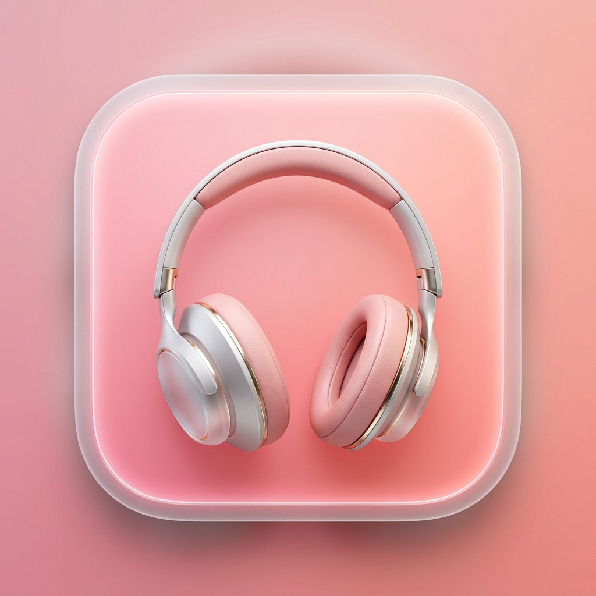

<div align="center">



# Thock for macOS

**Bring the satisfying sound of premium mechanical keyboards to every keystroke on your Mac.**

Built entirely in Rust. Zero latency. Real-time DSP engine. Lightweight by design.

[](https://www.rust-lang.org/)
[](https://www.apple.com/macos/)
[](LICENSE)

</div>

---

## What is Thock?

Thock is a macOS app that intercepts your keystrokes using the native CoreGraphics event tap and plays back beautiful mechanical keyboard sounds in real time — no lag, no CPU waste, no bloat.

It ships two modes:
- **`thock-app`** (GUI) — A premium Glassmorphism GUI. Because it uses WebKit for rendering, it is relatively heavy (uses about **~150 MB** of RAM while open).
- **`thock-cli`** (Headless) — An ultra-minimal terminal daemon with tab-autocomplete. Extremely lightweight (uses about **~10 MB** of RAM).

---

## Installation

### Clone & Build

```bash
git clone https://github.com/Dharmit-Parmar/Thock-for-macOS-.git
cd Thock-for-macOS-
```

### Run the GUI App
```bash
cargo run --release --bin thock-app
```

### Run the Lightweight CLI (Recommended for low RAM usage)
```bash
cargo run --release --bin thock-cli
```

### Build a native `.app` bundle and install to Applications
```bash
./build_mac_app.sh
mv Thock.app /Applications/
open /Applications/Thock.app
```

### Make `thock` a global terminal command
```bash
cargo install --path . --bin thock-cli
ln -sf ~/.cargo/bin/thock-cli ~/.cargo/bin/thock
```
After this, just type `thock` from anywhere in your terminal.

---

## First-Time Setup — Accessibility Permissions

Thock needs macOS Accessibility access to listen for your keystrokes globally. This is a one-time setup.

1. Open **System Settings → Privacy & Security → Accessibility**
2. Toggle **ON** for **Thock** or your **Terminal** app (if running via Cargo)
3. Restart the app after granting permission

> Thock does **not** log, store, or transmit your keystrokes. The event tap only triggers local audio playback.

---

## Features

### 🔊 Zero-Latency Audio Engine
Powered by macOS CoreGraphics native event taps and the `rodio` Rust audio engine. Key events are dispatched directly on the main thread with no intermediate queuing. Typical keystroke-to-audio latency is under 3ms.

### 🎛️ Real-Time Procedural DSP Engine
Don't want WAV files? Thock includes a physics-accurate mathematical sound synthesizer. Every parameter of a real mechanical switch is modelled:

| Parameter | Range | Effect |
|-----------|-------|--------|
| `switch` | cream / red / black / brown / blue | Switch type character |
| `weight` | 35–90g | Spring stiffness → impact velocity |
| `lube` | 0.0–1.0 | Friction noise floor + high-freq rolloff |
| `foam` | 0.0–1.0 | Dampening + soft saturation |
| `plate` | brass / aluminum / pom / polycarbonate | Fundamental resonant frequency |
| `case` | plastic / aluminum / polycarbonate | Ring time multiplier |
| `mount` | tray / gasket / top | Sub-bass isolation cutoff |
| `keycap` | pbt / abs | High-frequency damping |
| `orings` | 0.0–1.0 | Attack softening |
| `pitch` | 0.5–2.0 | Global pitch scaling |

Change any parameter live in the CLI:
```
> proc lube 0.9
> proc plate pom
> proc switch cream
```

### 📦 16 Built-in Sound Packs

| Pack | Character |
|------|-----------|
| `nk_cream` | Smooth, creamy POM thock |
| `nk_cream_procedural` | Live DSP version of NK Cream |
| `nk_cream_loud` | Louder, more aggressive cream |
| `cherry_mx_black_pbt` | Linear, deep, clacky |
| `cherry_mx_brown_pbt` | Tactile, quiet brown |
| `cherry_mx_brown_abs` | Softer brown on ABS |
| `cherry_mx_red_abs` | Light, smooth linear |
| `creamy_marbly` | Rich marbled cream tone |
| `creamy_heavy` | Heavy, satisfying thock |
| `creamy_thock_v2` | V2 tuned cream profile |
| `glassy_custom` | Glassy high-pitched clack |
| `eg_crystal_purple` | Crystal linear — bright & precise |
| `overlubed_custom` | Over-lubed smooth whisper |
| `pe_foam_creamy` | PE foam modded — muted thock |
| `animal_crossing_nl` | Soft, gentle Nintendo-style |
| `steelseries_apex_pro_v2` | OmniPoint magnetic linear |

### 🪟 Smart Window Memory Management (Cut RAM Usage)
If you are using the GUI (`thock-app`), you can drastically cut its RAM usage when you aren't actively changing settings. 
Simply press **`Cmd + W`** or click the red close button. 
Thock will tear down the WebKit renderer entirely — dropping RAM usage from **~150 MB** down to just **~15 MB**. Your keyboard sounds will continue playing perfectly in the background. Click the Dock icon to bring the window back instantly.

### ⭐ Favorites & Persistence
Star any pack in the GUI to pin it to the top. Your active pack and volume are automatically saved and restored between launches.

### 💻 CLI Tab-Autocomplete
The `thock-cli` uses `rustyline` for a full readline experience — Tab-completion for commands and pack names, command history with arrow keys, and clean `>` prompt.

```
> pack <Tab>          # lists all packs
> pack nk<Tab>        # completes to nk_cream
> proc <Tab>          # shows all procedural parameters
```

---

## CLI Commands

```
vol <0-100>           Set master volume
pack <name>           Switch to a sound pack (with tab-complete)
packs                 List all available packs
proc                  Show current procedural engine settings
proc <param> <value>  Adjust a procedural parameter live
help                  Show all commands
exit                  Quit
```

---

## Adding Custom Sound Packs

1. Create a folder in `packs/your_pack_name/`
2. Add your `.wav` files inside it
3. Create a `config.json`:

```json
{
  "defaults": ["default.wav"],
  "mappings": {
    "28": "enter.wav",
    "51": "backspace.wav",
    "49": "space.wav"
  },
  "pitch": 1.0,
  "vol_mult": 1.0
}
```

Key codes follow the Mechvibes standard. Thock auto-discovers new packs on next launch.

---

## Architecture

```
thock
├── src/
│   ├── lib.rs       Core engine — CGEventTap, audio dispatch, CLI REPL, IPC handler
│   ├── dsp.rs       Procedural DSP engine — modal synthesis, biquad filters, PRNG
│   ├── keymap.rs    Static CGKeyCode → Mechvibes code map (OnceLock, zero per-keystroke alloc)
│   └── bin/
│       ├── thock-app.rs    GUI entry point (tao + wry WebView)
│       └── thock-cli.rs    CLI entry point (headless)
├── packs/           Sound pack directories
└── ui.html          Glassmorphism frontend (TailwindCSS + vanilla JS IPC)
```

### Performance Optimizations
- **Lock-free hot path**: `AtomicU64` for velocity tracking — no mutex in the CGEventTap callback
- **Zero per-keystroke allocation**: Keymap is a static `OnceLock<HashMap>` built once at first keypress
- **~30× lower RAM**: WAV packs stored as raw bytes, decoded lazily on playback (~300KB vs ~9MB)
- **DSP time accumulation**: `t += dt` instead of per-sample integer division (eliminates 2,600+ divisions per keypress)
- **`Cell<usize>`** for round-robin pack index — zero-overhead interior mutability inside `Fn` closure

---

## Requirements

- macOS 12 Monterey or later (Apple Silicon & Intel)
- Rust stable toolchain (`rustup` recommended)

---

<div align="center">

Made with ❤️ and a lot of clacking

</div>
