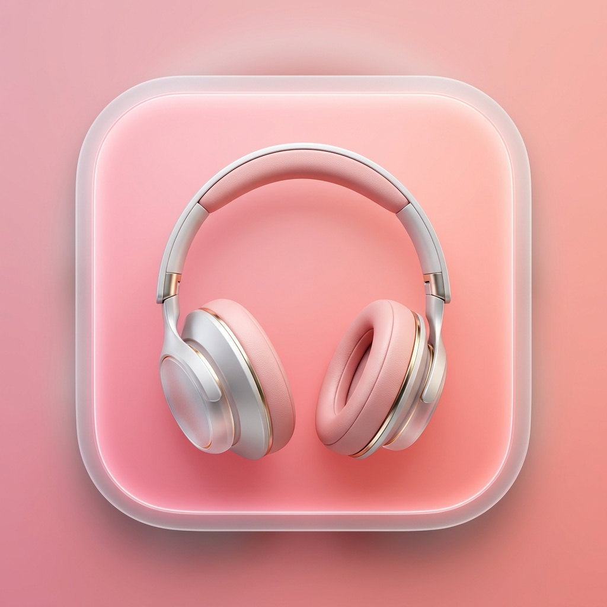

<div align="center">



# ⌨ Thock for macOS

**Bring the satisfying sound of premium mechanical keyboards to every keystroke on your Mac.**

Built entirely in Rust. Zero latency. Real-time DSP engine. Under 15 MB RAM in CLI mode.

[](https://www.rust-lang.org/)
[](https://www.apple.com/macos/)
[](LICENSE)

</div>

---

## What is Thock?

Thock intercepts your keystrokes using macOS CoreGraphics and plays back real mechanical keyboard sounds in real time — no lag, no CPU waste, no bloat.

It ships two modes:

| Mode | RAM | Best for |
|------|-----|----------|
| **CLI** (`thock-cli`) | ~10 MB | Always-on, runs in background, battery friendly |
| **GUI** (`thock-app`) | ~150 MB | Full visual interface with pack browser & ASMR mixer |

---

## ⚡ Recommended — One-Command Setup (CLI + GUI + Auto-Compile)

This is the same setup the developer uses. Typing `thock` anywhere in your terminal opens an interactive launcher that **always compiles and runs the latest code**.

### Step 1 — Install Rust

```bash
curl --proto '=https' --tlsv1.2 -sSf https://sh.rustup.rs | sh
```

### Step 2 — Clone the repo

```bash
git clone https://github.com/Dharmit-Parmar/Thock-for-macOS-.git ~/Thock
```

> You can clone it anywhere. Just replace `~/Thock` with your preferred path in Step 3.

### Step 3 — Install the global `thock` command

```bash
cat > ~/.cargo/bin/thock << 'EOF'
#!/bin/bash
cd "$HOME/Thock" || { echo "Error: Thock folder not found at ~/Thock."; exit 1; }

echo ""
echo "⌨️  Welcome to Thock"
echo "=================="
echo "1) CLI Mode (lightweight, ~10 MB RAM)"
echo "2) GUI App  (full interface, ~150 MB RAM)"
echo ""
read -p "Enter choice [1 or 2]: " choice

case $choice in
    1) echo "Launching CLI..."; cargo run --release --bin thock-cli -- "$@" ;;
    2) echo "Launching GUI..."; cargo run --release --bin thock-app -- "$@" ;;
    *) echo "Invalid choice."; exit 1 ;;
esac
EOF
chmod +x ~/.cargo/bin/thock
```

> **If you cloned to a different location**, change `$HOME/Thock` in the script to match your path.

### Step 4 — Grant Accessibility Permission

macOS requires one-time permission for Thock to read keystrokes.

1. Run `thock` once — it will automatically open **System Settings → Privacy & Security → Accessibility / Input Monitoring**
2. Add **Thock** (or your **Terminal app**) to the list and toggle it **on**
3. Run `thock` again — done ✓

### Step 5 — Launch

```bash
thock
```

Every time you run `thock`, Cargo checks if the code changed. If you pull a new update, it recompiles automatically before launching. No manual build step ever needed.

```
⌨️  Welcome to Thock
==================
1) CLI Mode (lightweight, ~10 MB RAM)
2) GUI App  (full interface, ~150 MB RAM)

Enter choice [1 or 2]:
```

---

## 🖥 GUI App — Drag & Drop Install (No Rust Required)

If you just want the GUI app without setting up a development environment, download the pre-built binary.

### [⬇ Download Thock.zip](https://github.com/Dharmit-Parmar/Thock-for-macOS-/raw/main/Thock.zip)

1. Unzip `Thock.zip`
2. Drag **Thock.app** into your `/Applications` folder
3. Right-click → **Open** on first launch (to bypass Gatekeeper)
4. Grant Accessibility permission when prompted

> **Note:** The pre-built ZIP is a snapshot. It will not update automatically when new features are added. The recommended terminal setup above always runs the latest version.

---

## CLI Commands

Once running in CLI mode, type `help` to see all commands:

```
❯ help

  ┌─ Commands ────────────────────────────────────────────┐
  │  vol <0-100>   Set master volume
  │  pack <name>   Switch to a sound pack
  │  packs         List all available packs
  │  proc          View/Edit procedural synthesis settings
  │  asmr          ASMR background audio (rain/wind/thunder)
  │  quit / exit   Close Thock
  └───────────────────────────────────────────────────────┘
```

### Quick examples

```bash
# Switch pack
❯ pack cherry_mx_brown_pbt

# Set volume to 70%
❯ vol 70

# Turn on rain ambience
❯ asmr rain

# View all packs
❯ packs

# Tune the procedural engine
❯ proc lube 0.8
❯ proc switch cream
```

Tab autocomplete works on all commands and pack names.

---

## Sound Packs

16 built-in packs included:

| Pack | Type | Character |
|------|------|-----------|
| `creamy_marbly` | Linear | Deep, marbly thock |
| `creamy_thock_v2` | Linear | Full-bodied, smooth |
| `overlubed_custom` | Linear | Silent, buttery |
| `nk_cream` | Linear | Iconic NK cream sound |
| `nk_cream_loud` | Linear | NK cream, unlubed |
| `pe_foam_creamy` | Linear | PE-foam dampened |
| `glassy_custom` | Linear | High-pitched, glassy |
| `creamy_heavy` | Linear | Heavy spring thock |
| `cherry_mx_red_abs` | Linear | Cherry red on ABS |
| `cherry_mx_black_pbt` | Linear | Cherry black on PBT |
| `cherry_mx_brown_abs` | Tactile | Cherry brown on ABS |
| `cherry_mx_brown_pbt` | Tactile | Cherry brown on PBT |
| `eg_crystal_purple` | Tactile | EG Crystal Purple |
| `animal_crossing_nl` | Special | Nintendo-style chimes |
| `steelseries_apex_pro_v2` | Special | OmniPoint magnetic |
| `nk_cream_procedural` | Procedural | Real-time DSP synthesis |

### Adding Custom Packs

1. Create a folder inside `packs/` with your pack name (e.g. `packs/my_switches/`)
2. Add your WAV or OGG audio files
3. Create a `config.json` in that folder:

```json
{
  "defaults": ["default.wav"],
  "mappings": {
    "36": "enter.wav",
    "49": "space.wav"
  },
  "pitch": 1.0,
  "vol_mult": 1.0
}
```

4. Switch to it: `pack my_switches`

---

## ASMR Background Audio

Thock ships a full ASMR engine with three independent layers:

```bash
❯ asmr rain          # Enable rain layer
❯ asmr wind          # Enable wind layer  
❯ asmr thunder       # Enable thunder layer
❯ asmr none          # Disable all layers

❯ asmr rain_vol 80   # Rain volume 80%
❯ asmr rain_dens 60  # Rain density/intensity
❯ asmr wind_gust 40  # Wind gustiness
❯ asmr thunder_freq 50  # Thunder frequency
❯ asmr vol 70        # Master ASMR volume
```

---

## Procedural Synthesis Engine

No audio files needed. Thock can synthesize keyboard sounds from math in real-time using its built-in DSP engine:

```bash
❯ proc                     # View current settings
❯ proc switch cream        # Switch type: cream | red | black | brown | blue
❯ proc lube 0.8            # Lube amount (0.0 = scratchy, 1.0 = silent)
❯ proc weight 55           # Spring weight in grams (40–90)
❯ proc foam 0.3            # Foam dampening (0.0–1.0)
❯ proc plate brass         # Plate material: brass | pom | fr4 | pc | aluminum
❯ proc case aluminum       # Case material: aluminum | plastic
❯ proc mount gasket        # Mounting: tray | gasket
❯ proc pitch 1.1           # Overall pitch shift
```

---

## Architecture

```
CGEventTap (main thread, macOS)
    │
    ├── KeyDown → pick sound from LoadedPack (Arc<Vec<u8>> bytes)
    │              └── rodio: Decoder<Cursor<bytes>> → stream to audio device
    │
    └── ASMR polling thread (50ms ticks)
           ├── rain_sink  ─ LoopingDecoder (zero-copy, no Buffered)
           ├── wind_sink  ─ LoopingDecoder
           └── thunder_sink ─ one-shot on random trigger
```

- Keystroke sounds: raw compressed bytes stored per pack. Decoded per-play by rodio. Pack RAM: ~1–3 MB.
- ASMR loops: custom `LoopingDecoder` restarts the OGG decoder on loop end with no heap caching.
- GUI: `wry` + `tao` WebView over a Tailwind CSS + Glassmorphism `ui.html`.
- CLI: `rustyline` REPL with tab-autocomplete, history, colored output.

---

## Requirements

- macOS 12 Ventura or later
- Apple Silicon or Intel Mac
- Rust 1.75+ (for the source build)

---

## License

MIT — see [LICENSE](LICENSE)

---

<div align="center">

Made with ❤️ and way too many keyboard switches.

</div>
